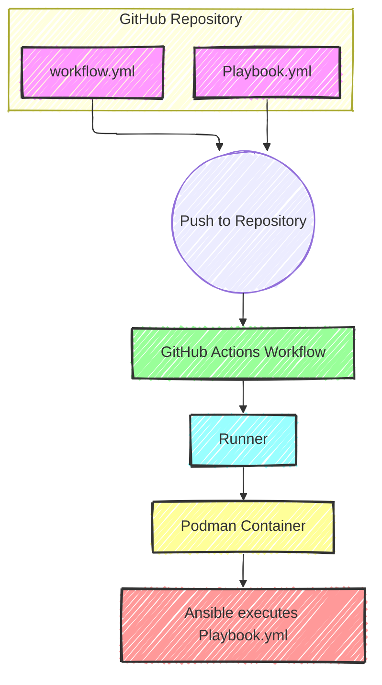

# graphs

```mermaid
---
config:
  layout: elk
  look: handDrawn
---
graph TD
    subgraph GitHub Repository
        A[Playbook.yml]
        B[workflow.yml]
    end

    A & B --> C((Push to Repository))
    C --> D[GitHub Actions Workflow]
    D --> E[Runner]
    E --> F[Podman Container]
    F --> G[Ansible executes Playbook.yml]

    style A fill:#f9f,stroke:#333,stroke-width:2px
    style B fill:#f9f,stroke:#333,stroke-width:2px
    style D fill:#9f9,stroke:#333,stroke-width:2px
    style E fill:#9ff,stroke:#333,stroke-width:2px
    style F fill:#ff9,stroke:#333,stroke-width:2px
    style G fill:#f99,stroke:#333,stroke-width:2px
```
