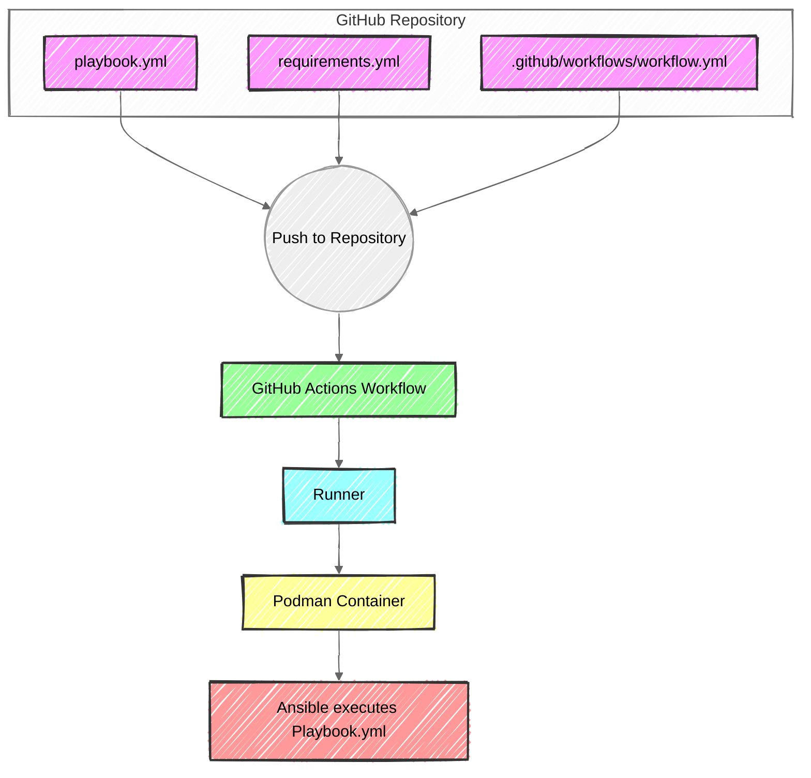

# graphs

```mermaid
---
config:
  look: handDrawn
  theme: neutral

---
graph TD
    subgraph GitHub Repository
        A[playbook.yml]
        B[requirements.yml]
        C[.github/workflows/workflow.yml]
    end

    A & B & C --> D((Push to Repository))
    D --> E[GitHub Actions Workflow]
    E --> F[Runner]
    F --> G[Podman Container]
    G --> H[Ansible executes Playbook.yml]

    style A fill:#f9f,stroke:#333,stroke-width:2px
    style B fill:#f9f,stroke:#333,stroke-width:2px
    style C fill:#f9f,stroke:#333,stroke-width:2px
    style E fill:#9f9,stroke:#333,stroke-width:2px
    style F fill:#9ff,stroke:#333,stroke-width:2px
    style G fill:#ff9,stroke:#333,stroke-width:2px
    style H fill:#f99,stroke:#333,stroke-width:2px

```
